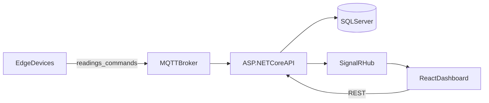

# Web-Based IoT Device Real-Time Monitoring System

A browser-based dashboard for monitoring IoT equipment in real time—collecting sensor data over MQTT, storing history in SQL Server, pushing live updates via SignalR, and sending device commands back to the edge.

**Capstone project** — BAS Application Development Program  
**Developed By:** Quoc Bao Tran
**Status:** As-built (May 2026)

---

## Why this project

Industrial, commercial, and agricultural sites need continuous equipment monitoring to stay safe and avoid failures. Traditional SCADA systems are expensive and tie you to proprietary hardware. This system offers a cost-effective alternative: a web dashboard accessible from any browser, built on open-source stack components, and compatible with standard IoT hardware (Arduino, ESP32, Raspberry Pi).

---

## Architecture



| Layer | Responsibility |
|-------|----------------|
| **Edge** | Microcontrollers publish sensor readings and receive commands over MQTT |
| **Backend** | REST API, MQTT ingest, JWT auth, EF Core persistence |
| **Real-time** | SignalR hub at `/monitoringhub` streams readings, alerts, and device status |
| **Frontend** | React SPA with MUI dashboards, charts, and role-based navigation |
| **Database** | SQL Server — 11 tables for devices, sensors, readings, alerts, users, commands |

---

## Features

- **Real-time monitoring** — Live sensor readings and device online/offline status via SignalR
- **Dashboards and charts** — Recharts line trends, gauges, and discrete (0/1) indicators; live and historical windows
- **Alerting** — Threshold, range, and change rules; acknowledge and resolve; real-time notifications
- **Device management** — CRUD for devices, sensors, actuators, and configurations
- **Device control** — Commands over MQTT (`SetPower`, `SetValue`); command history page
- **Security** — JWT authentication with **Admin**, **Operator** (read/write), and **Viewer** (read-only) roles
- **MQTT pipeline** — Ingest readings, publish commands, health metrics endpoint

---

## Technology stack

| Layer | Technologies |
|-------|--------------|
| Backend | C# ASP.NET Core 8, EF Core, SignalR, MQTTnet, JWT |
| Frontend | React 18, TypeScript, Material-UI, Recharts, Create React App |
| Database | SQL Server (LocalDB in development) |
| Edge / messaging | MQTT (Mosquitto local, HiveMQ cloud for demos) |
| CI/CD | GitHub Actions → Azure Web App + Azure Static Web Apps |

---

## Repository structure

```
capstone_project/
├── Backend/                        # Four .NET projects: API, Core, Infrastructure, Services
├── Frontend/iot-monitoring-frontend/ # React TypeScript SPA
├── Sensor Testing/                   # Python simulators, Arduino sketches, pipeline scripts
├── Documents/                        # Formal specs 001–010, testing, database scripts, slides
├── .github/workflows/                # Azure deployment pipelines
└── requirements.txt                  # Python deps for MQTT simulators (paho-mqtt)
```

| Folder | Purpose |
|--------|---------|
| [Backend/](Backend/) | Layered ASP.NET Core Web API |
| [Frontend/iot-monitoring-frontend/](Frontend/iot-monitoring-frontend/) | React dashboard |
| [Sensor Testing/](Sensor%20Testing/) | Hardware and simulator assets — see [Sensor Testing/README.md](Sensor%20Testing/README.md) |
| [Documents/](Documents/) | Full project documentation — start at [Documents/README.md](Documents/README.md) |

---

## Prerequisites

- Windows 10/11 (primary development environment)
- [.NET 8 SDK](https://dotnet.microsoft.com/download/dotnet/8.0)
- [Node.js 18+](https://nodejs.org/) and npm
- SQL Server or **LocalDB** (default: `(localdb)\mssqllocaldb`)
- [Mosquitto](https://mosquitto.org/) or another MQTT broker on `localhost:1883`
- Optional: Python 3 + `pip install -r requirements.txt` for simulators
- Optional: Arduino IDE + Uno R4 WiFi for hardware testing

---

## Quick start (local)

### 1. Database

Default connection string in `Backend/IoTMonitoringSystem.API/appsettings.json`:

```
Server=(localdb)\mssqllocaldb;Database=IoTMonitoringDB;Trusted_Connection=True
```

The API applies EF Core migrations automatically on startup (`db.Database.Migrate()` in `Program.cs`). Start the backend once and the database is created.

To reset and re-seed: [Documents/database/README-Reset-Database.md](Documents/database/README-Reset-Database.md)

### 2. MQTT broker

Start Mosquitto on port **1883** (matches `appsettings.json` → `Mqtt:Host` / `Mqtt:Port`).

Optional firewall rules: `Sensor Testing/Add-MosquittoFirewallRules.ps1`

### 3. Backend

```powershell
cd Backend
$env:ASPNETCORE_ENVIRONMENT = "Development"
dotnet run --project IoTMonitoringSystem.API/IoTMonitoringSystem.API.csproj
```

| Service | URL |
|---------|-----|
| API | http://localhost:5000 |
| Swagger | http://localhost:5000/swagger |
| SignalR | http://localhost:5000/monitoringhub |
| REST base | http://localhost:5000/api/v1 |
| MQTT health | http://localhost:5000/api/v1/health/mqtt |

Default login (development seed): `admin` / `Admin@123`

### 4. Frontend

```powershell
cd Frontend/iot-monitoring-frontend
npm install --legacy-peer-deps
npm start
```

Web app: http://localhost:3000

Optional environment variables (defaults in `src/config/runtimeConfig.ts`):

```
REACT_APP_API_BASE_URL=http://localhost:5000/api/v1
REACT_APP_SIGNALR_HUB_URL=http://localhost:5000/monitoringhub
```

### 5. Send test data

**Python simulator (no hardware):**

```powershell
pip install -r requirements.txt
python "Sensor Testing/simulator-local.py"
```

**Automated API tests:**

```powershell
powershell -ExecutionPolicy Bypass -File "Documents/testing/Run-ApiTests.ps1"
```

Register a device and sensors in the UI first so simulator device/sensor IDs match. See [Sensor Testing/README.md](Sensor%20Testing/README.md) for Arduino sketches and ID setup.

---

## MQTT topics

| Direction | Topic |
|-----------|--------|
| Device → API | `devices/{deviceId}/sensors/{sensorId}/readings` |
| API → Device | `devices/{deviceId}/commands` |
| Device → API | `devices/{deviceId}/commands/ack` |

Reading payload: `{"value": 22.5}` (analog) or `{"value": 1}` (discrete).

---

## Live demo (Azure)

Deployed via GitHub Actions on push to `main`:

| Component | URL |
|-----------|-----|
| **Dashboard** | https://tran.iot-dashboard.app/ |
| API | https://capstoneiotdashboard-gudbg0amfxeehae5.westus-01.azurewebsites.net |
| Swagger | https://capstoneiotdashboard-gudbg0amfxeehae5.westus-01.azurewebsites.net/swagger |

Cloud pipeline check: `Sensor Testing/Check-CloudPipeline.ps1`

---

## Testing

| Resource | Purpose |
|----------|---------|
| [Documents/testing/Run-ApiTests.ps1](Documents/testing/Run-ApiTests.ps1) | Automated REST API tests |
| [Documents/testing/MANUAL_TEST_CHECKLIST.md](Documents/testing/MANUAL_TEST_CHECKLIST.md) | UI, SignalR, MQTT, demo checklist |
| [Documents/007_TestingPlan.md](Documents/007_TestingPlan.md) | Formal test strategy |

---

## Documentation

**Start here:** [Documents/README.md](Documents/README.md)

| # | Document |
|---|----------|
| 1 | [001_Overview](Documents/001_Overview.md) |
| 2 | [002_Requirements](Documents/002_Requirements.md) |
| 3 | [003_DatabaseDesign](Documents/003_DatabaseDesign.md) |
| 4 | [004_ApplicationDesign](Documents/004_ApplicationDesign.md) |
| 5 | [005_FrontendDesign](Documents/005_FrontendDesign.md) |
| 6 | [006_APIDocumentation](Documents/006_APIDocumentation.md) |
| 7 | [007_TestingPlan](Documents/007_TestingPlan.md) |
| 8 | [008_DeploymentGuide](Documents/008_DeploymentGuide.md) |
| 9 | [009_ImplementationGuide](Documents/009_ImplementationGuide.md) |
| 10 | [010_UserManual](Documents/010_UserManual.md) |

Also: [Documents/testing/](Documents/testing/) · [Documents/Presentation/](Documents/Presentation/) · [Documents/database/](Documents/database/)

---

## Deployment

- **Local / full setup:** [Documents/008_DeploymentGuide.md](Documents/008_DeploymentGuide.md)
- **Backend CI:** [.github/workflows/main_capstoneiotdashboard.yml](.github/workflows/main_capstoneiotdashboard.yml) → Azure Web App
- **Frontend CI:** [.github/workflows/azure-static-web-apps-yellow-forest-08dd65c0f.yml](.github/workflows/azure-static-web-apps-yellow-forest-08dd65c0f.yml) → Azure Static Web Apps

Do not commit production secrets (JWT key, MQTT credentials, connection strings). Use Azure App Settings or user secrets for production.

---

## License

Academic capstone project. All rights reserved unless otherwise noted.
